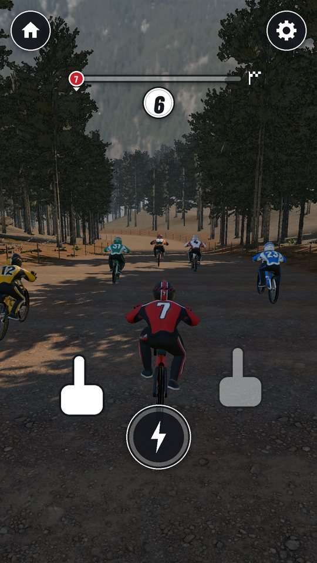
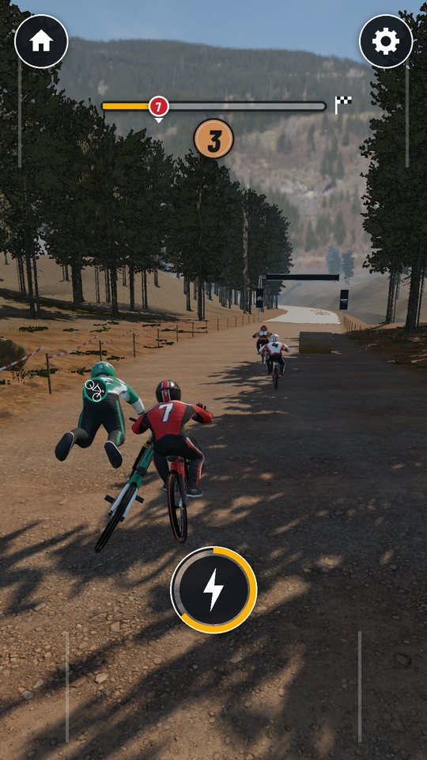
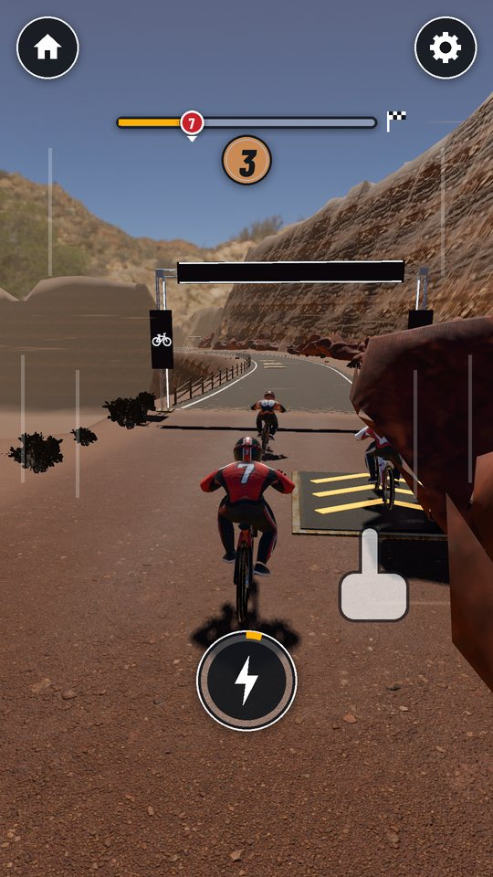
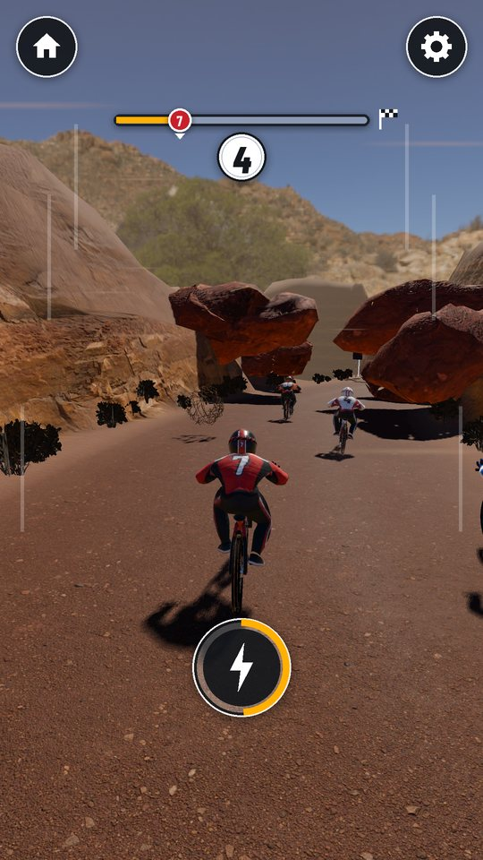

# MWM Race Riders

**[⬇ Download the APK (Android)](https://github.com/Matswm86/mwm-race-riders/releases/download/latest/mwm-race-riders.apk)**

 

A realistic downhill racer for Android, made for children (ages 4-7 on "Lett", 8+ on "Vanlig"). Hold the left or right side of the screen to steer a mountain bike, and later a hoverboard, against five rivals: speed pads, jumps with automatic tricks, gates that swap your vehicle, and a finish in about 45 seconds. Steer into a rival's side to knock it off its bike; rivals can only nudge you, you never fall, and everyone finishes. No ads, no tracking, works offline, no Android permissions.

Every level is its own world. This build has two:

- **World 1 "Furuløypa / Pine Run"** (950 m): alpine pine forest on a summer afternoon, course tape, hay bales, mud puddles, a gravel river road for the hoverboard, pollen and falling needles in the air.
- **World 2 "Ørkenjuvet / Red Canyon"** (980 m): a dry wash between red sandstone walls, a rusty water tower, sand drifts (the hoverboard floats over them), rolling tumbleweeds, an old rim highway and the mesa-gap jump, blowing sand.

Finishing a world opens the next one. Rules and numbers: `docs/GDD.md`. Look: `docs/DESIGN.md`.

| Start | Knock-off | Swap gate | Tumbleweed | Card |
|---|---|---|---|---|
|  |  |  |  |  |

All screenshots come from the real Godot build (screenshot bot, `tests/capture.tscn`).

## Install on a phone or tablet

1. On the device, tap [mwm-race-riders.apk](https://github.com/Matswm86/mwm-race-riders/releases/download/latest/mwm-race-riders.apk) (or open the [latest release](https://github.com/Matswm86/mwm-race-riders/releases/tag/latest)).
2. Open the file and allow "Install from this source" if Android asks.
3. If an older build will not update (signature mismatch), uninstall it first.

The APK runs on 64-bit phones and 32-bit tablets (arm64-v8a and armeabi-v7a). It is debug-signed, for sideloading only.

## How to play

- Hold the left half of the screen to steer left, the right half to steer right. The newest finger wins.
- Touch anywhere (or wait 4 seconds) and the start lights count you in.
- Ride over the amber chevron pads for speed; three in a row go faster each time.
- Steer into the side of a rival riding next to you and it tumbles off its bike, then gets up and rides on. Mud and sand slow you a little, hay bales burst, tumbleweeds push you aside; nothing makes you fall.
- Tap the round lightning disc when it is full for a boost. On "Lett" it boosts by itself, and the rider follows a helper line when you let go.
- After your first finish, the gates turn your bike into a hoverboard and back, and the next world opens (the card's biggest disc). When you race a world again, your best run there rides along as a see-through ghost that fades away when it gets close to you.
- Gear (top right): tap twice to open settings (difficulty, sound, music, ghost, less motion, graphics Høy/Lav). Three-finger tap shows the performance readout (fps, draw calls, memory).

## Graphics

Realistic look: scanned PBR textures, HDRI skies, a matching sun with real shadows, depth fog, AgX tone mapping. "Høy" (default) adds the sun shadow, glow on the LEDs, 2x MSAA, normal maps everywhere, the full forest and grass, and sun shafts in world 1. "Lav" (32-bit tablet) drops shadows and glow, uses FXAA, keeps normal maps on the racers only, thins the forest and cuts grass at 15 m. 32-bit devices start on "Lav", and the game drops to "Lav" by itself if a race runs under 45 fps for 3 seconds.

## For a host app (MWM Play)

The autoload `RaceRiders` holds the hooks: `set_full_unlock(on)` (default `true`, so the stand-alone build has everything open), `set_difficulty(easy)`, `set_shell_inset(inset)`, `set_sfx_on`, `set_music_on`, `set_haptics_on`, `set_less_motion`, `save_game()`, and the signals `level_card_shown(track_id)` (the world id) and `free_levels_finished()`. With `set_full_unlock(false)` only world 1 is open. With `Engine.set_meta(&"mwm_play_shell", true)` the game hides its own home disc, shows only the volume, ghost and graphics rows in settings, and leaves the back button to the host. Save file: `user://race_riders_save.json`.

## Development

- Godot 4.6, `mobile` renderer, portrait 1080x1920. APKs are built by GitHub Actions on every push to `main`.
- Race test (pure-sim batches on both worlds, knock-off bot, ghost fade, flash limiter, touch zones at portrait size, full races in the real scene with no input): `godot --headless --audio-driver Dummy --resolution 1080x1920 res://tests/race_test.tscn`
- Screenshot bot and graphics cost probe: `tests/capture.tscn` (phases `shots`, `cost`, `look`, `thumbs`; see the header of `tests/capture.gd`).
- The static worlds are baked to `assets/generated/world1.res` and `world2.res`; after changing `RrWorldGen` or a track in `RrWorlds`, run `godot --headless -s tests/bake_world.gd` and bump `RrWorldBake.VERSION`.
- Art: GLBs and textures are rebuilt by `tools/art/` (DESIGN section 16). The GLBs are imported without their embedded textures (`tools/write_imports.py`); the game builds every material from the loose files in `assets/textures/`, so each texture ships once. HUD sprites: `python3 tools/art/make_hud_atlas.py`.
- Sound effects: `python3 tools/render_sfx.py --kenney <folder with kenney_impact-sounds>`.
- Lint: `gdlint scripts tests` and `gdformat --check scripts tests`.

Credits and licences: `CREDITS.md`. Font: Barlow Condensed (SIL OFL 1.1, `assets/fonts/BarlowCondensed-OFL.txt`).
