# MWM Race Riders

**[⬇ Download the APK (Android)](https://github.com/Matswm86/mwm-race-riders/releases/download/latest/mwm-race-riders.apk)**

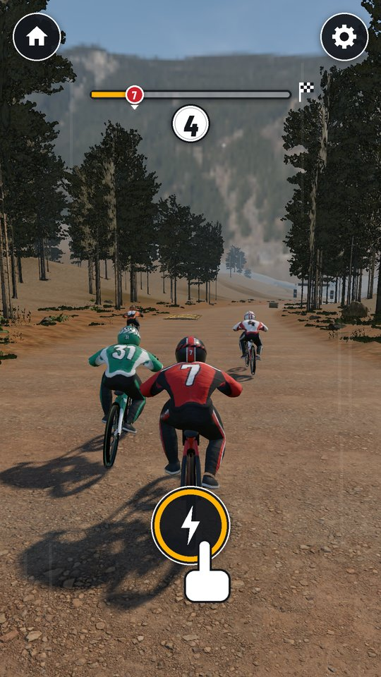 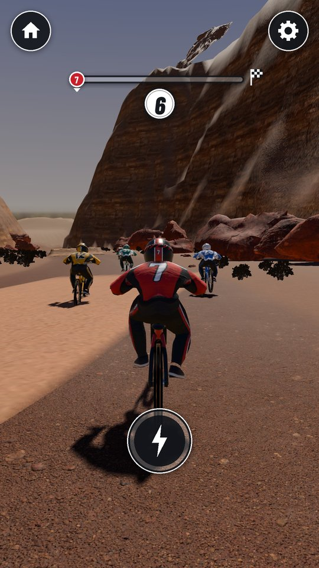

A fast, realistic downhill racer for Android, made for children (ages 4-7 on "Lett", 8+ on "Vanlig"). Hold the left or right side of the screen to steer a mountain bike, and later a hoverboard, against five rivals: speed pads, jumps with automatic tricks, gates that swap your vehicle, and a finish in 44-51 seconds at 108 km/h cruise (up to 173 km/h on boost). Steer into a rival's side to knock it off its bike; rivals can only nudge you, you never fall, and everyone finishes. No ads, no tracking, works offline, no Android permissions.

## Levels: 32 races in two worlds

Each world has 8 tracks, and each track has a Pro variant: 16 tracks and 16 Pro races in this build.

- **World 1 "Furuløypa / Pine Run"**: alpine pine forest on a summer afternoon, course tape, hay bales, mud puddles, a gravel river road for the hoverboard, a rock tunnel and the gully plank jump.
- **World 2 "Ørkenjuvet / Red Canyon"**: red sandstone walls, sand drifts (the hoverboard floats over them), rolling tumbleweeds, a narrow slot canyon, the old rim highway and the mesa-gap jump.

Track 1 of each world is the hand-made course; tracks 2-8 are built from that world's kit of 15 pieces, each with its own order of bends, jumps, hindrances and set pieces, its own scenery (dense forest or open meadow, wide wash or tight canyon) and 25 m more length than the one before. Pro variants are the same track mirrored, at sunset, with two extra hindrances and slightly faster rivals. Every track has three medal times (gold, silver, bronze) and keeps your best run as a ghost.

| Pine Run: tunnel | Pine Run: gully jump | Pine Run: river road | Red Canyon: slot canyon | Red Canyon: rim highway | Red Canyon: mesa gap |
|---|---|---|---|---|---|
| 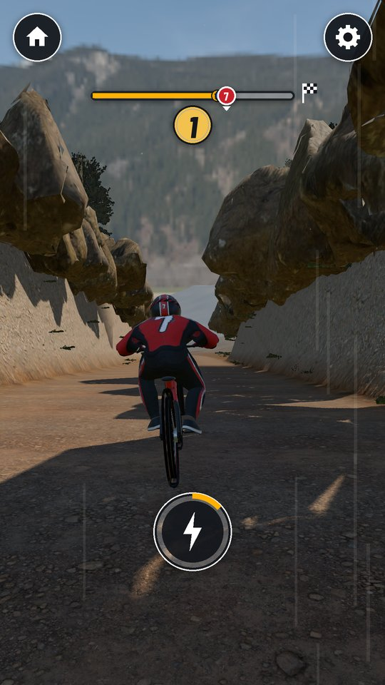 | 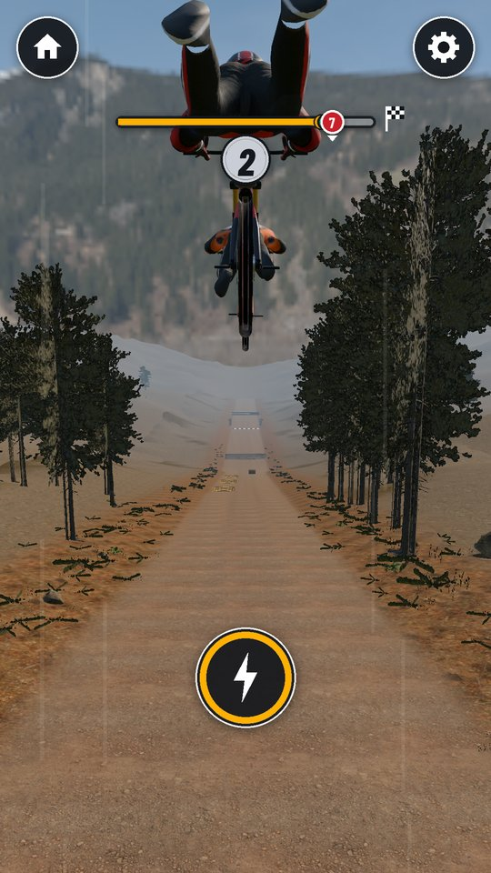 | 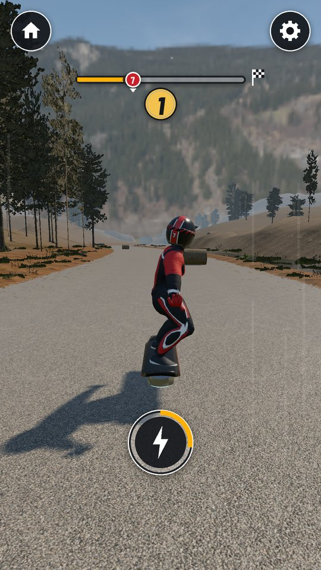 | 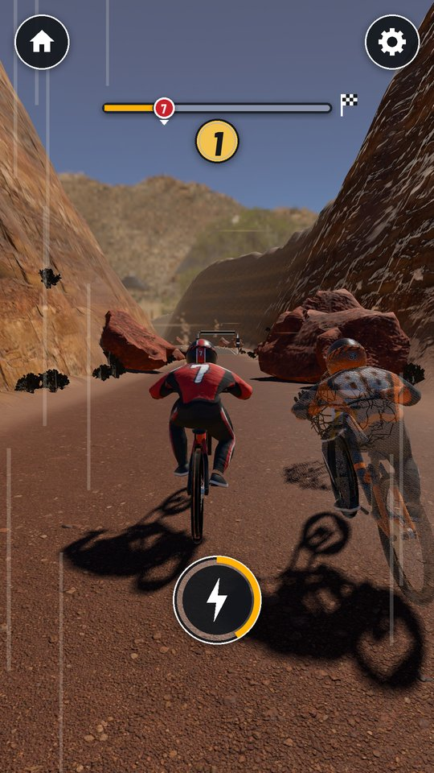 | 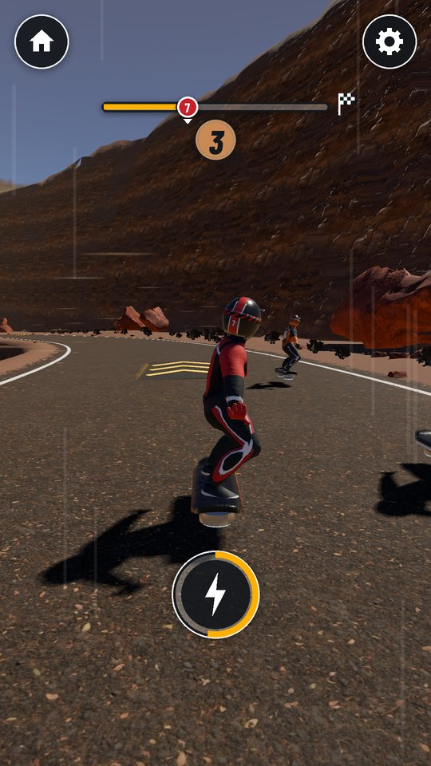 | 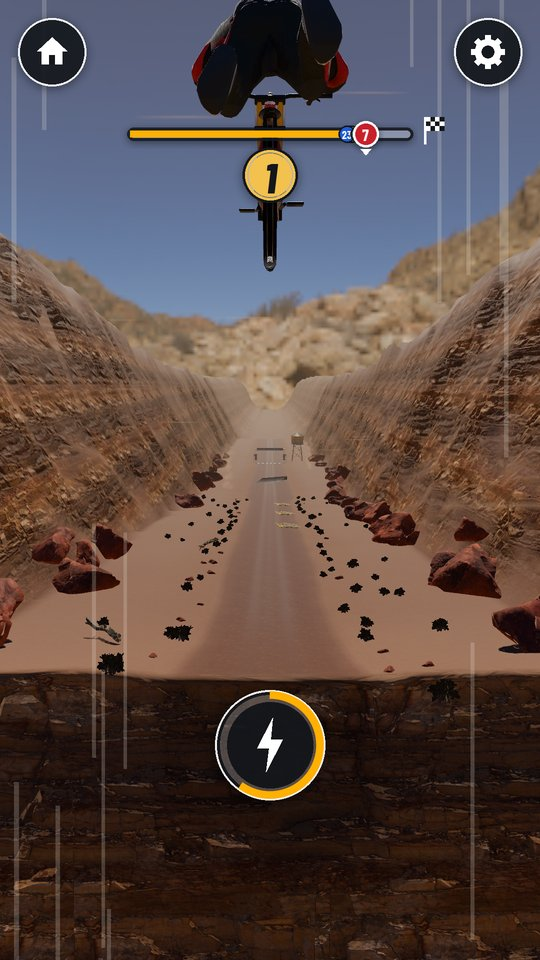 |

## Leagues

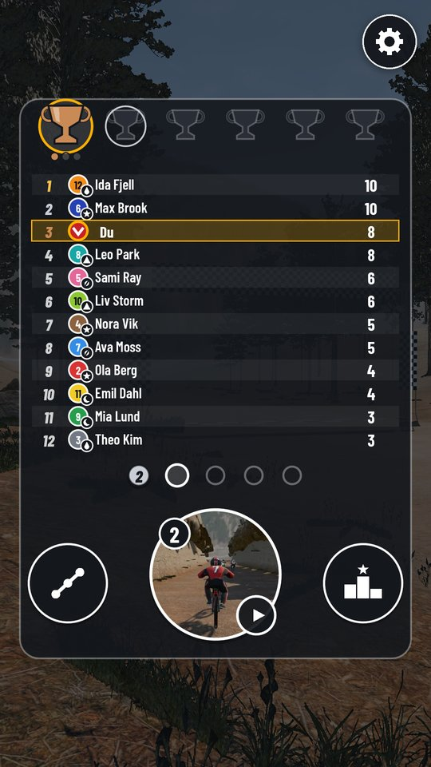 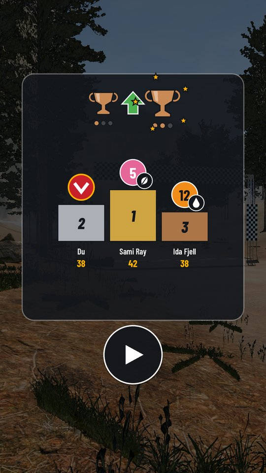

The home screen is a league table you can use without reading: one big disc races the next round, everything else is shapes and digits. You race in Bronze (world 1) and Silver (world 2), each with tiers III, II and I. A season is 5 rounds on 5 different tracks: tier III uses tracks 1-5, tier II tracks 6-8 plus a preview of the next world, tier I the Pro tracks. You race the five rivals nearest you in points while the other six race their own heat; places score 10, 8, 6, 5, 4 and 3 points, and the top 3 of the 12-rider table move up a tier, with a cosmetic reward (paint set, part, league trophy). On "Lett" nobody ever drops and a child who gets stuck is moved up after two seasons; on "Vanlig" the bottom two drop only if "Nedrykk" is switched on in settings. Rivals never score while you are away; after 8 hours they just show a small form arrow. Gold to Champion show as dark cups until their worlds exist.

The map disc opens free ride: any track or Pro race on its own, no points, with your ghost and the track's board of best times.

| Card | League table | Promotion | Free ride | Track board |
|---|---|---|---|---|
| 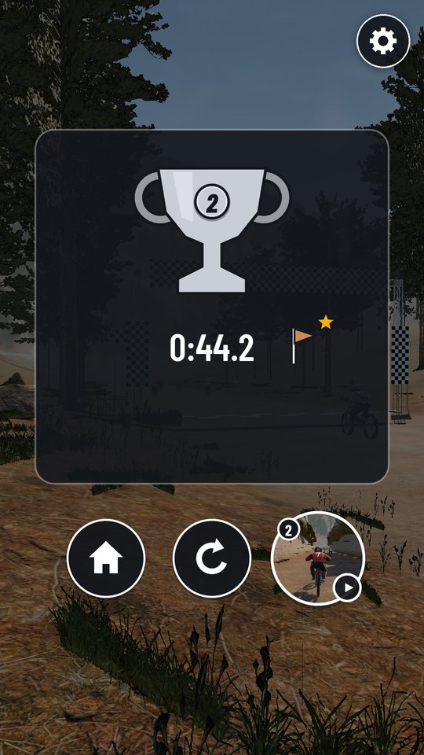 | 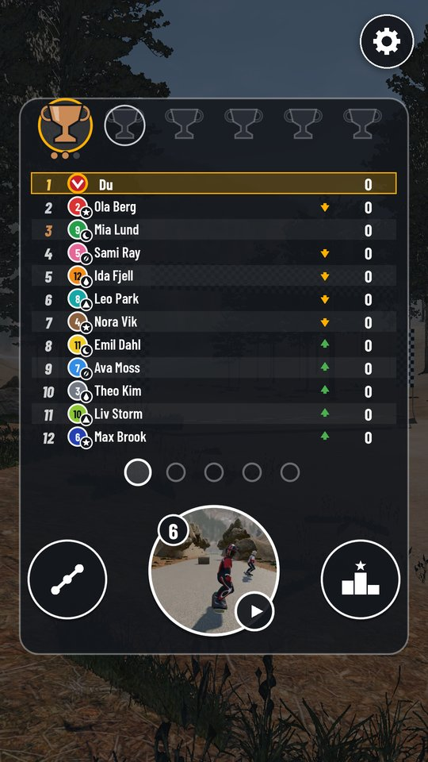 | 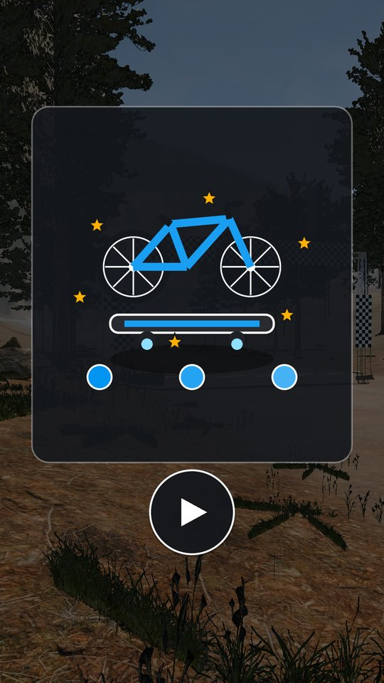 | 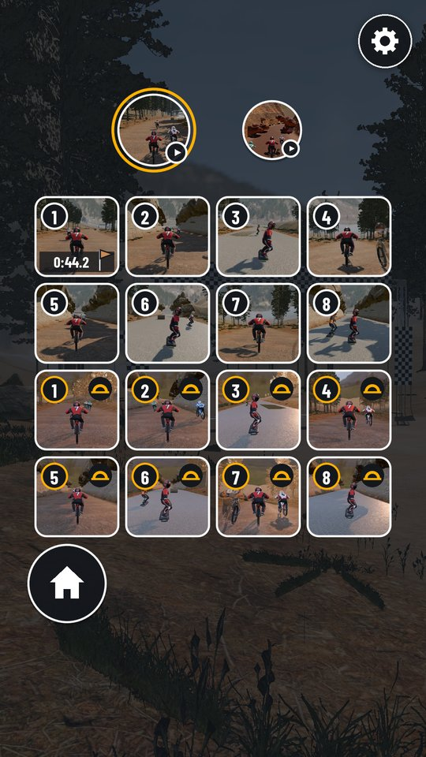 | 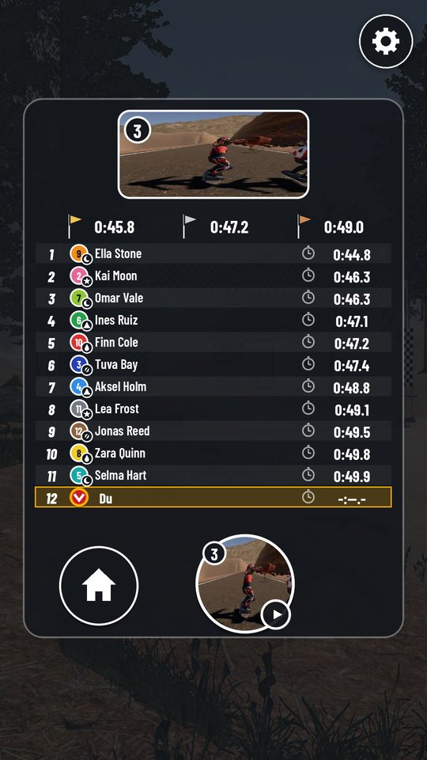 |

All screenshots come from the real Godot build (screenshot bot, `tests/capture.tscn`). Rules and numbers: `docs/GDD.md` (section 17 for tracks and leagues). Look: `docs/DESIGN.md`.

## Install on a phone or tablet

1. On the device, tap [mwm-race-riders.apk](https://github.com/Matswm86/mwm-race-riders/releases/download/latest/mwm-race-riders.apk) (or open the [latest release](https://github.com/Matswm86/mwm-race-riders/releases/tag/latest)).
2. Open the file and allow "Install from this source" if Android asks.
3. If an older build will not update (signature mismatch), uninstall it first.

The APK runs on 64-bit phones and 32-bit tablets (arm64-v8a and armeabi-v7a). It is debug-signed, for sideloading only.

## How to play

- Hold the left half of the screen to steer left, the right half to steer right. The newest finger wins.
- Touch anywhere (or wait 4 seconds) and the start lights count you in.
- Ride over the amber chevron pads for speed; three in a row go faster each time.
- Steer into the side of a rival riding next to you and it tumbles off its bike, then gets up and rides on. Mud and sand slow you a little, hay bales burst, tumbleweeds push you aside; nothing makes you fall.
- Tap the round lightning disc when it is full for a boost. On "Lett" it boosts by itself, and the rider follows a helper line when you let go.
- After your first finish, the gates turn your bike into a hoverboard and back. The card's biggest disc opens the league table; its big disc starts the next round. When you race a track again, your best run there rides along as a see-through ghost that fades away when it gets close to you.
- Gear (top right): tap twice to open settings (difficulty, Nedrykk, sound, music, ghost, less motion, graphics Høy/Lav). Three-finger tap shows the performance readout (fps, draw calls, memory).

## Graphics

Realistic look: scanned PBR textures, HDRI skies, a matching sun with real shadows, depth fog, AgX tone mapping. "Høy" (default) adds the sun shadow, glow on the LEDs, 2x MSAA, normal maps everywhere, the full forest and grass, and sun shafts in world 1. "Lav" (32-bit tablet) drops shadows and glow, uses FXAA, keeps normal maps on the racers only, thins the forest and cuts grass at 15 m. 32-bit devices start on "Lav", and the game drops to "Lav" by itself if a race runs under 45 fps for 3 seconds.

## For a host app (MWM Play)

The autoload `RaceRiders` holds the hooks: `set_full_unlock(on)` (default `true`, so the stand-alone build has every track open for free ride), `set_difficulty(easy)`, `set_shell_inset(inset)`, `set_sfx_on`, `set_music_on`, `set_haptics_on`, `set_less_motion`, `save_game()`, and the signals `level_card_shown(track_id)` (world x 10 + track, +100 for Pro: world 1 track 3 = 13) and `free_levels_finished()`. With `set_full_unlock(false)` the game is the Bronze III season (world 1 tracks 1-5); its season end sends `free_levels_finished` (once per session) instead of promoting, and it can be replayed forever. With `Engine.set_meta(&"mwm_play_shell", true)` the game hides its own home disc, shows only the volume, ghost and graphics rows in settings, and leaves the back button to the host. Save file: `user://race_riders_save.json`.

## Development

- Godot 4.6, `mobile` renderer, portrait 1080x1920. APKs are built by GitHub Actions on every push to `main`.
- Race test (every track with an idle Lett bot, landing zones, knock-off bot, ghost fade, flash limiter, league rules, the MWM Play free part, save migration, touch targets, and a whole Bronze III season in the real scene with no input): `godot --headless --audio-driver Dummy --resolution 1080x1920 res://tests/race_test.tscn`
- Screenshot bot and graphics cost probe: `tests/capture.tscn` (phases `shots`, `tracks`, `cost`, `look`, `thumbs`; see the header of `tests/capture.gd`).
- Tracks: `python3 tools/track_gen.py --list 1 3` lists the 20 valid layouts of world 1 track 3; pin a pick in `tools/track_picks.json`, then `python3 tools/track_gen.py --write` (after `godot --headless -s tests/export_t1.gd` if track 1 changed), `godot --headless -s tests/par_times.gd` (par and medal times) and `godot --headless -s tests/bake_world.gd` (one baked landscape per track in `assets/generated/`; bump `RrWorldBake.VERSION` when `RrWorldGen` changes). Track pictures: capture phase `thumbs`, then `python3 tools/make_thumbs.py <capture dir>`.
- Art: GLBs and textures are rebuilt by `tools/art/` (DESIGN section 16). The GLBs are imported without their embedded textures (`tools/write_imports.py`); the game builds every material from the loose files in `assets/textures/`, so each texture ships once. HUD sprites: `python3 tools/art/make_hud_atlas.py`.
- Sound effects: `python3 tools/render_sfx.py --kenney <folder with kenney_impact-sounds>`.
- Lint: `gdlint scripts tests` and `gdformat --check scripts tests`.

Credits and licences: `CREDITS.md`. Font: Barlow Condensed (SIL OFL 1.1, `assets/fonts/BarlowCondensed-OFL.txt`).
