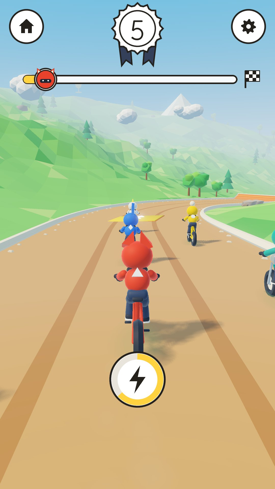
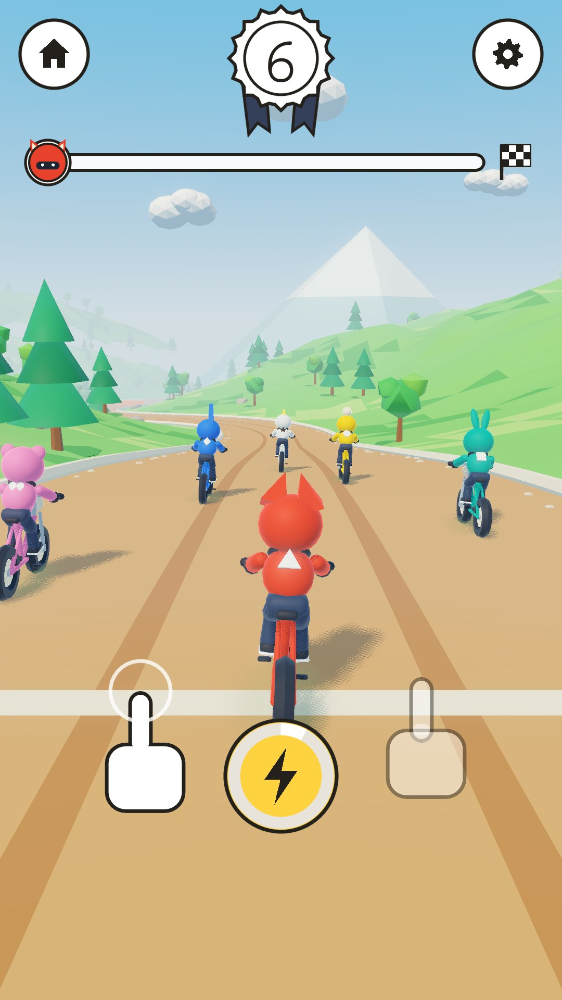
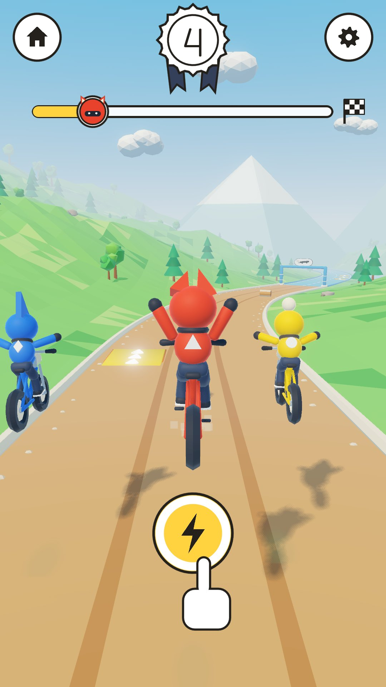
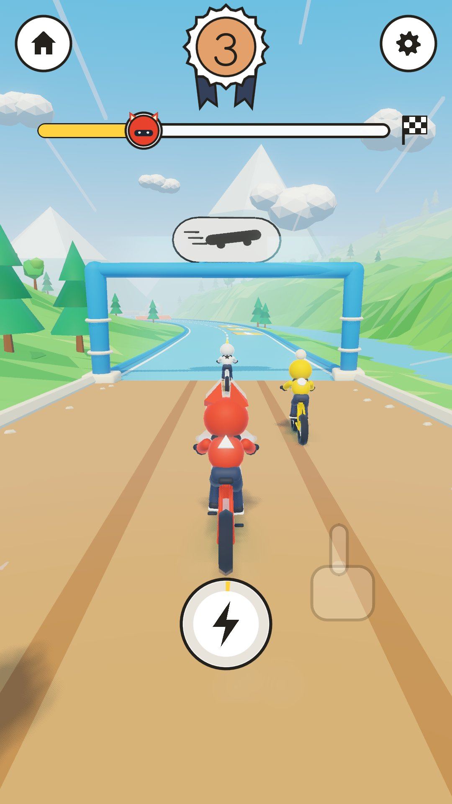
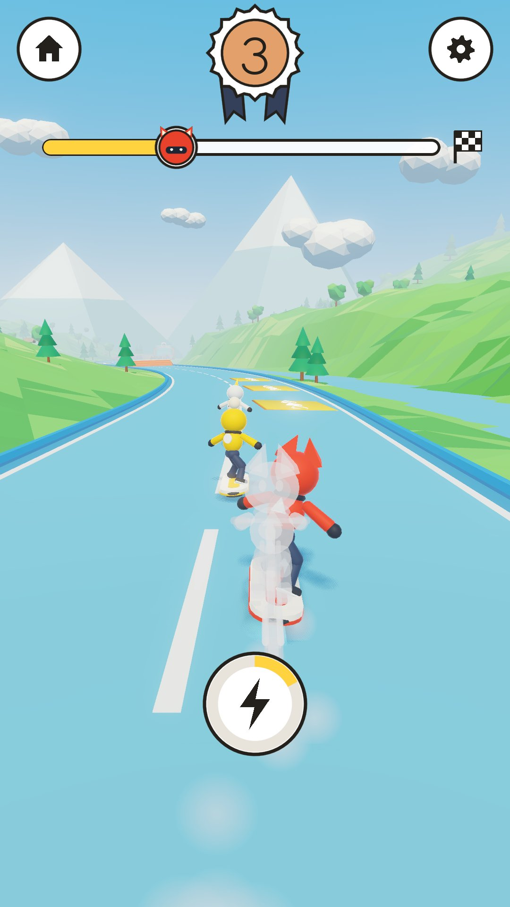
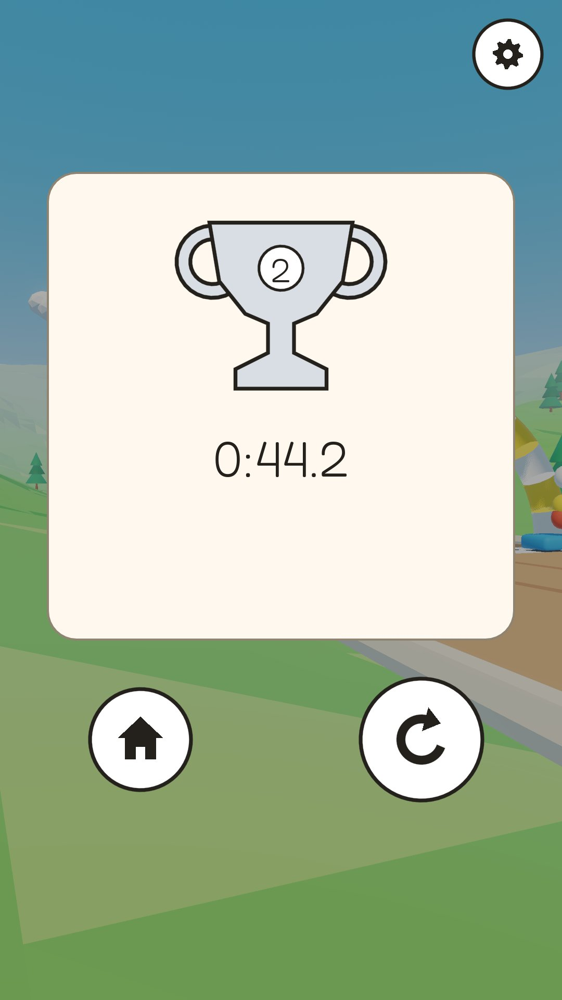

# MWM Race Riders

**[⬇ Download the APK (Android)](https://github.com/Matswm86/mwm-race-riders/releases/download/latest/mwm-race-riders.apk)**

A sunny toy downhill racer for Android, made for children (ages 4-7 on "Lett", 8+ on "Vanlig"). Hold the left or right side of the screen to steer a mountain bike, and later a hoverboard, down a mountain trail against five rival riders: speed pads, jumps with automatic tricks, magic gates that swap your vehicle, and a finish in about 45 seconds. Nobody crashes and everyone finishes. No ads, no tracking, works offline, no Android permissions.

This is the **vertical slice**: track 1 "Furuløypa / Pine Run" (950 m) with 10 speed pads, 4 jumps, 4 hay bales, 2 swap gates and the finish arch; bike and hoverboard; 5 rival riders; Lett and Vanlig; boost; your own ghost; the reward card; settings. Design: `docs/GDD.md` (rules and numbers) and `docs/DESIGN.md` (look).

| Start | Jump | Swap gate | Hoverboard | Card |
|---|---|---|---|---|
|  |  |  |  |  |

## Install on a phone or tablet

1. On the device, tap [mwm-race-riders.apk](https://github.com/Matswm86/mwm-race-riders/releases/download/latest/mwm-race-riders.apk) (or open the [latest release](https://github.com/Matswm86/mwm-race-riders/releases/tag/latest)).
2. Open the file and allow "Install from this source" if Android asks.
3. If an older build will not update (signature mismatch), uninstall it first.

The APK runs on 64-bit phones and 32-bit tablets (arm64-v8a and armeabi-v7a). It is debug-signed, for sideloading only.

## How to play

- Hold the left half of the screen to steer left, the right half to steer right. The newest finger wins.
- Touch anywhere (or wait 4 seconds) and the start lights count you in.
- Ride over the glowing yellow pads for speed; three in a row go faster each time.
- Tap the round lightning disc when it is full for a boost. On "Lett" it boosts by itself, and the rider follows a helper line when you let go.
- After your first finish, the gates turn your bike into a hoverboard and back. Your best run rides along as a see-through ghost.
- Gear (top right): tap twice to open settings (difficulty, sound, music, ghost, less motion, graphics Høy/Lav). Three-finger tap shows the performance readout (fps, draw calls, memory).

## Graphics

"Høy" (default) adds a sun shadow on the riders and kit, glow on the pads and boost trail, filmic tone mapping with a light colour grade, the sun in the sky, 2x MSAA, GPU wheel dust and speed streaks, and a rim light on the riders. "Lav" keeps the phone budget in `docs/DESIGN.md` 7e (no shadow, no glow, FXAA). 32-bit devices start on "Lav", and the game drops to "Lav" by itself if a race runs under 45 fps for 3 seconds.

## For a host app (MWM Play)

The autoload `RaceRiders` holds the hooks: `set_full_unlock(on)` (default `true`, so the stand-alone build has everything open), `set_difficulty(easy)`, `set_shell_inset(inset)`, `set_sfx_on`, `set_music_on`, `set_haptics_on`, `set_less_motion`, `save_game()`, and the signals `level_card_shown(track_id)` and `free_levels_finished()`. With `Engine.set_meta(&"mwm_play_shell", true)` the game hides its own home disc, shows only the volume, ghost and graphics rows in settings, and leaves the back button to the host. Save file: `user://race_riders_save.json`.

## Development

- Godot 4.6, `mobile` renderer, portrait 1080x1920. APKs are built by GitHub Actions on every push to `main`.
- Race test (pure-sim batches, flash limiter, touch zones, two full races in the real scene with no input): `godot --headless --audio-driver Dummy res://tests/race_test.tscn`
- Screenshot bot and graphics cost probe: `tests/capture.tscn` (phases `shots` and `cost`; see the header of `tests/capture.gd`).
- The static world is baked to `assets/generated/track1_world.res`; after changing `RrWorldGen` or the track, run `godot --headless -s tests/bake_world.gd` and bump `RrWorldBake.VERSION`.
- Sound effects: `python3 tools/render_sfx.py --kenney <folder with kenney_impact-sounds>`.
- Lint: `gdlint scripts tests` and `gdformat --check scripts tests`.

Credits and licences: `CREDITS.md`. Font: Fredoka (SIL OFL 1.1, `assets/fonts/Fredoka-OFL.txt`).
